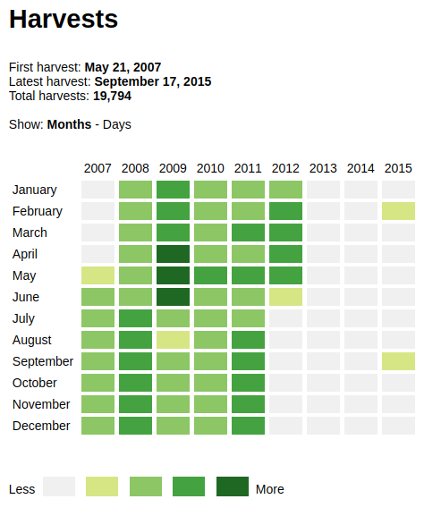
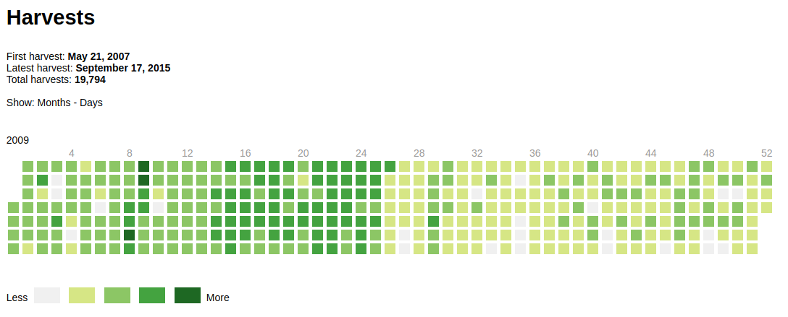
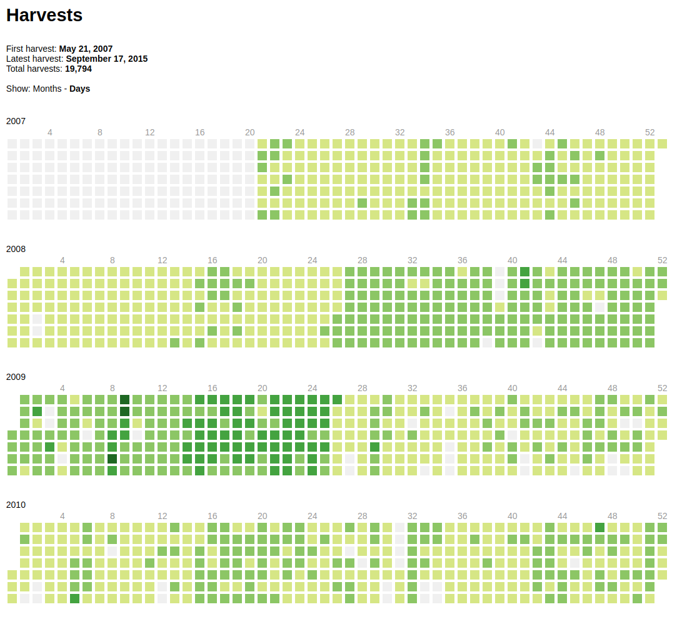

# Heatmap

A Javascript / VueJS / date-fns library to visualize activity in a graph. It takes inspiration from GitHubs commit activity graph.

Note: For now it is only compatible with newer browsers, as we haven't set up transpilation yet. It uses ES6 language features.

See examples of views below.

## Usage

To set up it needs a the `window.heatmap` object set up to transfer basic configuration to the app. Set that in the HTML of the page you are using the widget:

```
<script>
    // Hand over configuration from JSP to Javascript
    window.heatmap = {};

    // This is not used in the application, but is used to transfer the URL to other variables below.
    window.heatmap.url = "https://the-web-page-to-show-data-for.com";

    // Title for the graph.
    window.heatmap.title = "Data for " + window.heatmap.url;

    // The endpoint which will be called with a GET-request.
    // Should return a JSON Object with an array of unix timestamps called "dates".
    window.heatmap.dataUrl = "https://get-data-for.com/dates?url=" + window.heatmap.url;

    // A function which will be called when generating links back to a particular data object.
    // d is a Javascript Date object.
    window.heatmap.generateLink = function(d) {
        if (!d)     // If there is no data
            return;

        return "https://the-link-to-the-particular-date.com";
    };
</script>
```

## Example
Run ```npm run example``` or ```yarn example``` and open localhost:8000/example.html in a browser. This requires python3 installed on your machine. 

### Year-month view:


### View of all days and weeks in a year:


### View of all days and weeks in all years:

